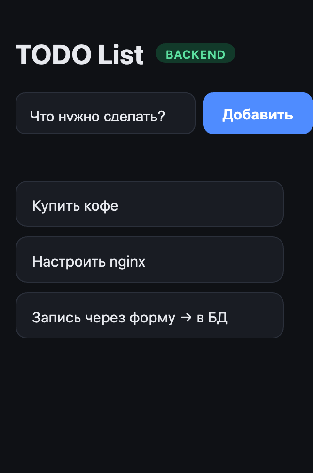

# Лаба 0/1 — свой сервис (TODO List)

Небольшое приложение из трёх частей, которое переиспользуется в лабах 1–3
(nginx, Docker, CI/CD).

- **Фронтенд** — Vite + vanilla JS. Форма + список задач. → [`frontend/`](frontend/)
- **Бэкенд** — Go + Gin + GORM. Эндпоинты пишут/читают из БД. → [`backend/`](backend/)
- **База данных** — PostgreSQL (отдельный сетевой сервис, не SQLite).



## Как части общаются

```
Браузер ──▶ Фронт (Vite, :5173)
Браузер ──/api──▶ Vite-прокси ──форвард──▶ Бэкенд (Gin, :5040, /api) ──SQL(pgx)──▶ PostgreSQL (:5432)
```

Фронт зовёт **свой же** `/api` (`VITE_BACKEND_URL=/api`), а Vite форвардит эти
запросы на бэкенд (server-side). Браузер видит один origin → **CORS на бэкенде
не нужен**, нет preflight-запросов `OPTIONS`. Бэкенд остаётся без изменений.

Куда форвардить — задаёт `BACKEND_PROXY_TARGET` в `frontend/.env` (origin
бэкенда, без пути `/api`): локальный `http://localhost:5040` или туннель.

Если `VITE_BACKEND_URL` пуст — фронт работает на mock-данных в памяти.

> Форвард реализован своим плагином на нативном Node (`frontend/vite.config.js`):
> встроенный http-proxy Vite рвёт TLS с туннелем из-за неверного SNI. Работает
> в `npm run dev` и `npm run preview`. В Лабе 1 ту же роль «один origin» возьмёт nginx.

## Контракты API

```
POST /api/task
Body: { "task": { "title": "string" } }
Ответ: 204 No Content
```

```
GET /api/tasks
Ответ: { "tasks": [ { "title": "string" } ] }
```

`Task = { "title": "string" }`. В БД у задачи есть ещё `id` (UUID), наружу он не отдаётся.

## Что нужно установить

- **Go** 1.25+
- **PostgreSQL** 14+ (локально или в Docker)
- **Node.js** 18+ (для фронта)

## Запуск

### 1. База данных

Вариант А — Docker:

```bash
docker run -d --name lab1-pg \
  -e POSTGRES_USER=todo_list_user \
  -e POSTGRES_PASSWORD=12345678 \
  -e POSTGRES_DB=todo_list_db \
  -p 5432:5432 postgres:16-alpine
```

Вариант Б — локальный PostgreSQL:

```bash
psql -d postgres <<'SQL'
CREATE ROLE todo_list_user LOGIN PASSWORD '12345678';
CREATE DATABASE todo_list_db OWNER todo_list_user;
SQL
psql -d todo_list_db -c 'CREATE EXTENSION IF NOT EXISTS "pgcrypto";'
```

> `pgcrypto` нужен для `gen_random_uuid()` в миграции. В Docker-образе он ставится
> автоматически при первом применении миграции; для локального PostgreSQL создать
> расширение под суперпользователем (команда выше).

### 2. Бэкенд

```bash
cd backend
cp .env.example .env      # при необходимости поправить креды/порт
go run ./internal
```

Схема БД накатывается автоматически (golang-migrate, каталог `backend/migrations`)
при старте. Сервис поднимется на `http://localhost:5040`.

> Запускать из каталога `backend/`: `.env` и `migrations/` ищутся относительно
> текущего каталога.

Быстрая проверка бэкенда без фронта:

```bash
curl -X POST http://localhost:5040/api/task \
  -H "Content-Type: application/json" \
  -d '{"task":{"title":"Первая задача"}}'

curl http://localhost:5040/api/tasks
# {"tasks":[{"title":"Первая задача"}]}
```

### 3. Фронтенд

```bash
cd frontend
npm install
cp .env.example .env
# .env:
#   VITE_BACKEND_URL=/api
#   BACKEND_PROXY_TARGET=http://localhost:5040        # локальный бэкенд
#   # или туннель:
#   BACKEND_PROXY_TARGET=https://<subdomain>.tunnel4.com
npm run dev
```

Открыть http://localhost:5173

Оба сценария работают без правок бэкенда — меняется только `BACKEND_PROXY_TARGET`:
- **всё локально** → `http://localhost:5040`;
- **бэкенд за туннелем** → URL туннеля.

## Проверка работоспособности

1. Открыть фронт — в шапке бейдж `BACKEND` (не `MOCK`).
2. Ввести текст, нажать «Добавить» — задача появляется в списке.
3. **Перезагрузить страницу** — задача на месте (лежит в PostgreSQL).
4. Убедиться напрямую в БД:

```bash
psql -d todo_list_db -c "SELECT id, title FROM tasks;"
```

## Переменные окружения

**backend/.env**

| Переменная          | Назначение                        | Пример            |
|---------------------|-----------------------------------|-------------------|
| `PORT`              | порт HTTP-сервера                 | `5040`            |
| `DB_HOST`           | хост PostgreSQL                   | `localhost`       |
| `DB_PORT`           | порт PostgreSQL                   | `5432`            |
| `DB_USER`           | пользователь БД                   | `todo_list_user`  |
| `DB_PASSWORD`       | пароль                            | `12345678`        |
| `DB_NAME`           | имя базы                          | `todo_list_db`    |

**frontend/.env**

| Переменная             | Назначение                                                        |
|------------------------|------------------------------------------------------------------|
| `VITE_BACKEND_URL`     | URL API для фронта. `/api` = через прокси. Пусто → mock-режим.    |
| `BACKEND_PROXY_TARGET` | origin бэкенда для форварда (без `/api`): localhost или туннель.  |

## Структура

```
lab1/
├── backend/
│   ├── internal/         # main, handler, dto, entities, database, logger
│   ├── migrations/       # SQL-миграции (up/down), golang-migrate
│   ├── go.mod / go.sum
│   └── .env.example
└── frontend/
    ├── src/              # main.js, api.js (контракты + mock), style.css
    ├── index.html
    ├── vite.config.js    # dev/preview + прокси /api → бэкенд (нативный forward)
    ├── docs/screenshot.png
    └── .env.example
```
