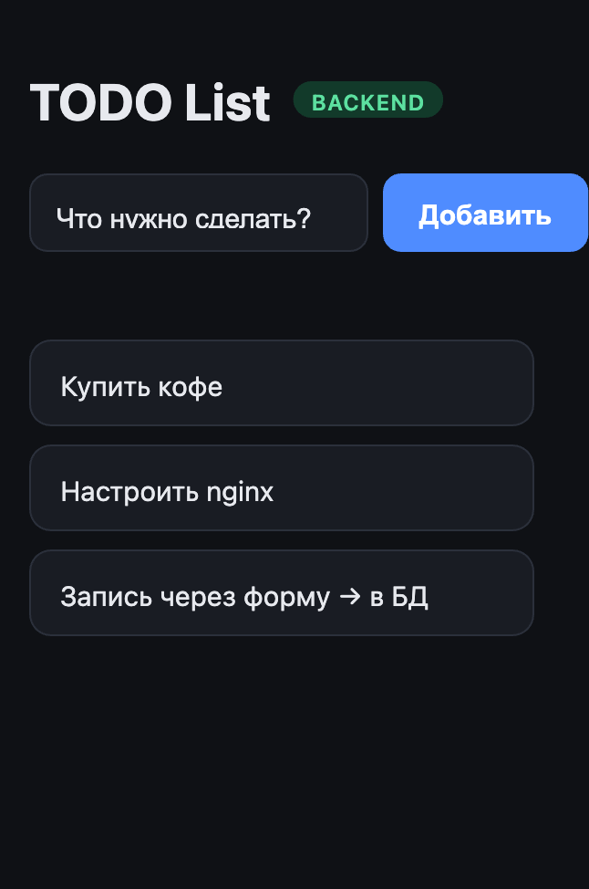

# Отчёт — Лаба 0 «Свой сервис»

## Репозиторий

https://github.com/undemorbe/site-dev-ops — код в каталоге [`lab1/`](.).

Инструкция запуска: [lab1/README.md](README.md).

## Что сделано

Приложение TODO List из трёх независимых частей:

| Часть   | Технология              | Роль                                             |
|---------|-------------------------|--------------------------------------------------|
| Фронт   | Vite + vanilla JS       | Страница: форма добавления + список задач         |
| Бэкенд  | Go + Gin + GORM         | `POST /api/task`, `GET /api/tasks` — пишет/читает БД |
| БД      | PostgreSQL              | Отдельный сетевой сервис, хранит задачи            |

Схема БД накатывается миграциями (golang-migrate) при старте бэкенда.
Таблица `tasks(id UUID PK, title TEXT NOT NULL)`.

## Скриншот работающего приложения



На скрине: бейдж `BACKEND` (фронт ходит в реальный бэкенд), задачи
`Купить кофе` и `Настроить nginx` загружены из БД, `Запись через форму → в БД`
добавлена через форму и осталась после перезагрузки страницы.

## Проверка работоспособности (выполнена)

1. Поднята PostgreSQL, применены миграции, запущен бэкенд на `:5040`.
2. `POST /api/task` дважды → `204 No Content`.
3. `GET /api/tasks` → `{"tasks":[{"title":"Купить кофе"},{"title":"Настроить nginx"}]}` (`200`).
4. Прямой запрос к БД подтвердил наличие строк:

   ```
   SELECT id, title FROM tasks;
                     id                  |      title
   --------------------------------------+-----------------
    8096ca14-127d-4ad8-88af-2a52e87d9987 | Купить кофе
    c6460c53-b2f1-452a-9465-bcb1aa7855fd | Настроить nginx
   ```

5. Через UI добавлена запись → перезагрузка страницы → запись на месте.
   Значит данные реально легли в PostgreSQL, а не в память браузера.

## Найденная и исправленная проблема (CORS / preflight)

Симптом: из браузера запросы к бэкенду уходили как `OPTIONS`, а не `GET`/`POST`.

Причина: фронт (`localhost:5173`) и бэкенд (туннель) — **разные origin**.
POST с `Content-Type: application/json` — «непростой» запрос, поэтому браузер
перед ним сам шлёт preflight `OPTIONS`. Бэкенд его не обрабатывал и не отдавал
`Access-Control-Allow-*` → preflight падал → реальный POST не отправлялся.

Решение — **не трогать бэкенд, а убрать cross-origin**: фронт зовёт свой же
`/api`, а Vite форвардит запросы на бэкенд server-side. Браузер видит один
origin → CORS и preflight не нужны вовсе.

Реализация: плагин-форвард на нативном Node в
[frontend/vite.config.js](frontend/vite.config.js). Встроенный http-proxy Vite
рвал TLS с туннелем (неверный SNI), нативный `https.request` ставит SNI из
hostname и работает. Цель форварда — `BACKEND_PROXY_TARGET`.

Проверка после фикса (запросы через прокси на `:5173`):

```
GET  /api/tasks  -> 200  {"tasks":[...]}
POST /api/task   -> 204
```

В браузере в панели network — только `GET`/`POST`, **`OPTIONS` больше нет**.
Проверено для обеих целей форварда: локальный `http://localhost:5040` и туннель.

Контракты сериализуются корректно: DTO (`dto.go`) с тегами `json`
(`task`, `tasks`, `title`) совпадают с тем, что шлёт/ждёт фронт; кириллица
проходит в UTF-8 без искажений. На фронте на `POST` восстановлен заголовок
`Content-Type: application/json`, на `GET` — `Accept: application/json`.

## Как запускается и как части общаются

```
Браузер → Фронт (Vite :5173) ──/api──▶ Vite-прокси ──▶ Бэкенд (Gin :5040, /api) → PostgreSQL (:5432, pgx)
```

Фронт зовёт `/api` (`VITE_BACKEND_URL=/api`); куда форвардить — задаёт
`BACKEND_PROXY_TARGET` (localhost или туннель). Бэкенд знает адрес БД из
`backend/.env` (`DB_*`). Пусто в `VITE_BACKEND_URL` → фронт в mock-режиме.

Два сценария без правок бэкенда:
- **всё локально**: `BACKEND_PROXY_TARGET=http://localhost:5040`;
- **бэкенд за туннелем**: `BACKEND_PROXY_TARGET=https://<subdomain>.tunnel4.com`.

Детали запуска — в [README.md](README.md).
