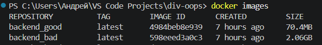
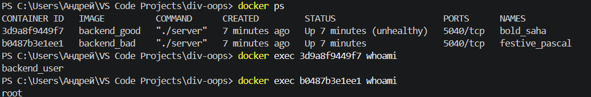
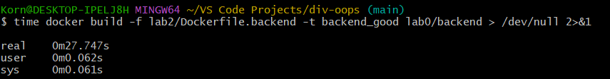
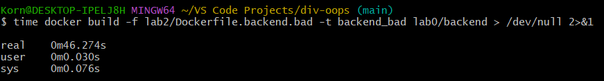
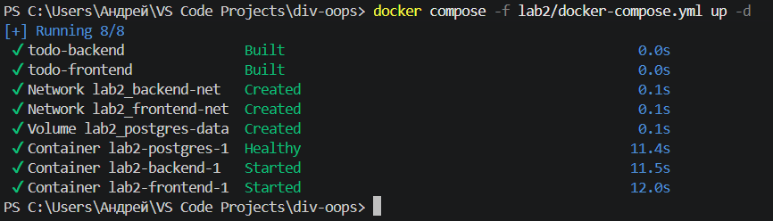
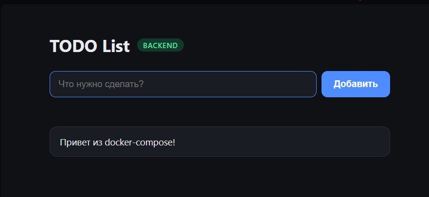
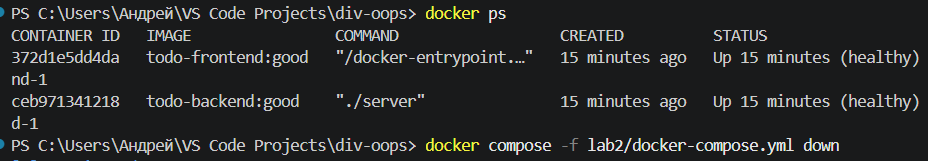
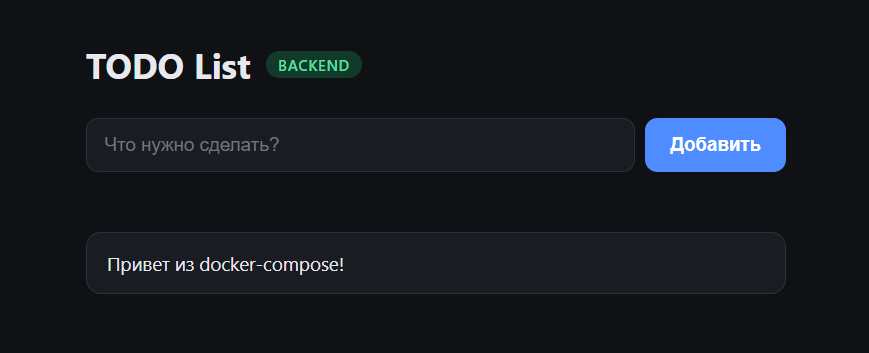
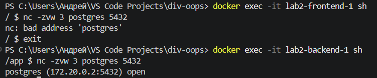

# Лаба 2 - контейнеризация всего нашего сайта

Поскольку фронтенд и бэкенд - два различных приложения, мы делаем для них отдельные Dokcerfile. Мы напишем "плохой" и "хороший" Dokcerfile для образа бэкенда и фронтенда

## Dokcerfile.backend

Для начала сделаем Dockerfile.backend.bad, содержащий несколько плохих практик при создании образа:

```
FROM golang:latest

WORKDIR /app

COPY . .

RUN go mod download

RUN CGO_ENABLED=0 GOOS=linux GOARCH=amd64 go build -o server ./internal

EXPOSE 5040

CMD ["./server"]
```

Здесь можно найти несколько плохих практик:

- golang:latest - здесь берется последняя версия, и из-за этого образ может меняться в зависимости от текущей версии, поэтом могут возникнуть проблемы

- Не правильный порядок слоев - сначала идет COPY . . , который копирует файлы внутрь образа, и только после этого идет RUN go mod download, копирующий зависимости. Из-за этого при небольшом изменении файлов в проекте придется заново устанавливать непоменявшиеся зависимости

- Нет multi-stage build - из-за того, что испольуется весь образ golang, образ может весить очень много. В идеале нужно использовать его только на сборке, чтобы он не занимал много места

- Запуск от root - не указан пользователь, а значит все запускается от root. Это считается плохой практикой, ведь не нужно выдавать приложению права, которые ему не нужны 

Переделаем Dockerfile.backend по нормальному:

```
FROM golang:1.25.11 AS builder

WORKDIR /app

COPY go.mod go.sum ./

RUN go mod download

COPY . .

RUN CGO_ENABLED=0 GOOS=linux GOARCH=amd64 go build -o server ./internal


FROM alpine:3.22.1

RUN adduser -D backend_user

WORKDIR /app

COPY --from=builder /app/server ./server

USER backend_user

EXPOSE 5040

HEALTHCHECK --interval=60s --timeout=5s --retries=3 CMD wget --spider -q http://localhost:5040/health || exit 1

CMD ["./server"]
```

Сначала исправляем проблему с образом go, а именно берем определенную версию (1.25.0). Также указываем, что будем использовать образ golang только для сборки (Привет, multi-stage build).

Добавляем нормальный порядок слоев: сначала копируем go.mod и go.sum (файлы с указанием зависимостей), потом устанавливаем зависимости (RUN go mod download). И только после этого мы копируем все файлы с кодом и компилируем приложение. Так мы добавляем кэширование зависимостей, и они не устанавливаются, если они не менялись. Компилируем код в файл server для следующей стадии
(P.S. Путем ошибок и страданий выяснилось, что просто так на Alpine бинарник Go не запускается, поэтому к строке RUN go build -o server ./internal нужно добавить CGO_ENABLED=0 GOOS=linux GOARCH=amd64 - только так наш бинарник начнет исправно запускаться на Alpine)

Переходим на вторую стадию. Сначала берем образ alpine для запуска сервера на нем. Добавляем второго пользователя (backend_user), которого потом будем использовать (строкой USER backend_user). Этим решим проблему root пользователем.

Берем результат компиляции и билдера, и кладем его в /app/server. Затем указываем порт и последней командой запускаем сервер.

Поскольку мы разделили Dockerfile на 2 стадии (build и runtime), во второй стадии мы уже не используем образ языка, так что размер нашего образа должен стать меньше.

Также мы добавили Healthcheck - раз в 60 секунд мы проверяем состояние сервера. На это мы даем 5 секунд и 3 попытки. Добавляем --spider, чтобы ответ сервера не сохранялся. Это проверяет, что контейнер живой и сервер работает.

Кроме того, не лишним будет добавить Dockerfile.backend.dockerignore, в котором уберем из образа файлы гита и IDE, .env, логи и временные файлы.

Проверим, что "хороший" Dockerfile лучше "плохого". Сначала найдем размеры образов:

Как можно заметить, "плохой" образ занимает в РАЗЫ больше места, чем хороший - это благодаря multi-stage build.

Теперь проверим пользователей. Запустим контейнеры с "хорошим" и "плохим" образами и посмотрим, какие у них владельцы:

Действительно, у хорошего контейнера пользователь - backend_user, у плохого - root.

Также проверим время билда образов с плохо и хорошо реализованным кэшированием. Для этого добавим одну строчку в код и пересоберем образы.

Для хорошего образа:

Для плохого образа:

Как можно заметить, разница во времени из-за плохого размещения слоев существенная.

Таким образом, можно сделать вывод, что Dockerfile с best-practices действительно оптимизированнее и надежнее

## Dockerfile.frontend

Определимся нюанс `vite build` превращает проект в статику — `index.html`, JS и CSS в папке `dist/`. После сборки Node больше не нужен, файлы остается только отдавать по HTTP, и здесь нам поможет... Nginx!
Мало весит, быстрый, умеет отдавать статику и проксировать запросы `/api` на бэкенд. `vite preview` и `vite dev` в продакшене использовать НЕ советуют — это инструменты для разработки, о чем прямо пишет документация Vite.

### 1) Плохой Dockerfile.frontend.bad

```
FROM node:latest

WORKDIR /app

COPY . .

RUN npm install

RUN npm run build

RUN npm install -g serve

EXPOSE 80

CMD ["serve", "-s", "dist", "-l", "80"]
```

Проблемы:

- `node:latest` — версия Node не зафиксирована. Сейчас `latest` это уже Node v26, завтра будет другая, и сборка может внезапно сломаться. То же самое с `npm install -g serve` без версии

- Нет multi-stage build — в финальном образе остается весь Node, `node_modules`, исходники и npm-кэш, хотя для работы нужна только папка `dist`. Как итог увидим — **1.88 ГБ**.

- Неправильный порядок слоев — `COPY . .` идет до `npm install`. Любая правка в коде меняет слой `COPY . .`, и Docker заново выполняет все после него: `npm install`, сборку и даже установку `serve`. Пересборка после изменения одной строки — **14 секунд** против 1 секунды у хорошего варианта.

- `npm install` вместо `npm ci` — `npm install` может молча обновить зависимости и переписать `package-lock.json`, поэтому сборки не воспроизводимы.

- Нет `.dockerignore` — `COPY . .` тащит в образ все подряд: локальные `node_modules` (собранные под macOS), `dist`, `docs`, а главное **секреты**. Проверили — внутри образа лежат `.env`, `localhost-key.pem` и `todo.local+3-key.pem`, то есть приватные ключи сертификатов. Любой, у кого есть образ, может их достать.

- Запуск от root - пользователь не указан, процесс работает с `uid=0`.

- Нет HEALTHCHECK — Docker не знает, отвечает ли сервер на самом деле.

- `serve` умеет только отдавать файлы. Проксировать `/api` на бекенд он не может, поэтому пришлось бы открывать бекенд наружу и настраивать CORS.

### 2) Хороший Dockerfile.frontend

Исправим все это в Dockerfile.frontend!

```
FROM node:22.23.3-alpine3.24 AS builder

WORKDIR /app

COPY package.json package-lock.json ./

RUN npm ci

COPY index.html vite.config.js ./
COPY src ./src

ARG VITE_BACKEND_URL=/api

RUN npm run build


FROM nginxinc/nginx-unprivileged:1.30.5-alpine3.24

COPY <<'CONF' /etc/nginx/conf.d/default.conf
server {
    listen 8080;
    server_name _;
    server_tokens off;

    root /usr/share/nginx/html;
    index index.html;

    resolver 127.0.0.11 valid=10s ipv6=off;

    gzip on;
    gzip_types text/css application/javascript application/json image/svg+xml;
    gzip_min_length 1024;

    location /assets/ {
        add_header Cache-Control "public, max-age=31536000, immutable";
        try_files $uri =404;
    }

    location / {
        add_header Cache-Control "no-cache";
        try_files $uri $uri/ /index.html;
    }

    location /api/ {
        set $backend http://backend:5040;
        proxy_pass $backend;

        proxy_http_version 1.1;
        proxy_set_header Host $host;
        proxy_set_header X-Real-IP $remote_addr;
        proxy_set_header X-Forwarded-For $proxy_add_x_forwarded_for;
        proxy_set_header X-Forwarded-Proto $scheme;

        proxy_connect_timeout 2s;
        proxy_read_timeout 15s;
    }
}
CONF

COPY --from=builder /app/dist /usr/share/nginx/html

USER nginx

EXPOSE 8080

HEALTHCHECK --interval=30s --timeout=5s --start-period=5s --retries=3 \
    CMD wget -q --spider http://127.0.0.1:8080/ || exit 1
```

#### Стадия сборки (builder)

Фиксируем точную версию `node:22.23.3-alpine3.24` для воспроизводимости, Alpine делает базу меньше. Образ Node нужен только на этой стадии (привет, multi-stage build).

Сначала `COPY package.json package-lock.json`, а потом `RUN npm ci`. Это кэш слоев - пока зависимости не поменялись, `npm ci` берется из кэша, и при правке кода он не перезапускается.

Используем `npm ci`, а не `npm install`, `npm ci` ставит зависимости строго по `package-lock.json` и падает, если lock-файл расходится с `package.json`. `npm install` в такой ситуации молча обновит зависимости, и две сборки одного кода могут получиться разными.

Копируем только то, что реально нужно для сборки (`index.html`, `vite.config.js`, `src`), а не все подряд. В образ не попадет лишнее, и кэш не сбрасывается из-за посторонних файлов.

`ARG VITE_BACKEND_URL=/api` - Vite вшивает переменные `VITE_*` прямо в JSбандл во время сборки, в рантайме их уже не поменять. Поэтому передаем адрес бэкенда как аргумент сборки (`ARG`) - он существует только во время сборки и его можно переопределить из compose. `ENV` для этого хуже - он остается в метаданных образа. Значение `/api` относительное, то есть браузер ходит на тот же хост, где открыт сайт (в nginx), и CORS не нужен.

#### Стадия запуска

`nginxinc/nginx-unprivileged` — вариант nginx, который сразу работает от непривилегированного пользователя (`uid 101`). Обычный образ `nginx` стартует от root, потому что занимает порт 80: порты ниже 1024 без root занять нельзя. Поэтому unprivileged-версия слушает порт **8080**.

Конфиг nginx встраиваем прямо в Dockerfile через heredoc (`COPY <<'CONF' ... CONF`). Контекст сборки - `lab0/frontend`, а `COPY` не может взять файл снаружи контекста. Так Dockerfile не требует отдельного файла с конфигом.

`COPY --from=builder /app/dist` — в финальный образ попадает только собранная статика: ни Node, ни `node_modules`, ни исходников, ни секретов. Итог - **90 МБ** против **1.88 ГБ** у `.bad`.

`USER nginx` - в базовом образе уже так, но строка явно фиксирует, что запуск не от root.

`HEALTHCHECK` через `wget --spider` раз в 30 секунд проверяет, что nginx отвечает (`--spider` - не скачивать тело ответа). `CMD` не пишем: он наследуется от базового образа (`nginx -g 'daemon off;'`).

#### Что в конфиге nginx

- `try_files $uri $uri/ /index.html` — SPA fallback: любой неизвестный путь отдает `index.html`, а дальше разбирается JS.
- `location /assets/` - Vite кладет в имена файлов хеш (`index-CWG7AxkJ.js`), поэтому их можно кэшировать в браузере на год (`immutable`). При изменении кода поменяется и имя файла.
- `Cache-Control: no-cache` для `index.html` — иначе браузер не увидит новый бандл после деплоя.
- `gzip` - сжимаем JS, CSS и JSON при отдаче.
- `server_tokens off` — не показываем версию nginx в заголовках.
- `location /api/` - проксируем запросы на бэкенд. Адрес задается через переменную `set $backend` + `resolver 127.0.0.11` (встроенный DNS Docker). Если написать `proxy_pass http://backend:5040` напрямую, nginx резолвит имя при старте и падает, если бэкенда нет. С переменной имя резолвится при каждом запросе, поэтому nginx стартует и без бэкенда (на `/api` отдаст 502), а когда бэкенд появится — заработает без правок конфига. Путь передается как есть (`/api/tasks` → `/api/tasks`), это совпадает с `r.Group("/api")` в бэкенде.
- `proxy_set_header Host / X-Real-IP / X-Forwarded-*` - чтобы бэкенд видел реальный IP клиента, а не IP nginx.
- `proxy_connect_timeout` и `proxy_read_timeout` - чтобы зависший бэкенд не держал соединения бесконечно.

#### Dockerfile.frontend.dockerignore

```
node_modules
dist
docs
.vite
.git
*.log
.env
.env.*
*.pem
```

Docker сам забирает файл, если он лежит рядом с Dockerfile. Исключаем:

- `node_modules` и `dist` — тяжелые, и их все равно пересоздадут `npm ci` и `vite build`. К тому же локальные `node_modules` собраны под macOS и в Linux-контейнере могут не работать.
- `.env*` и `*.pem` — секреты и приватные ключи не должны попасть даже в контекст сборки!!!!
- `.git`, `docs`, `*.log`, `.vite` - мусор

### 3) Сравнение

Замеры на одной машине (базовые образы уже скачаны). Пересборка — после изменения одной строки в `src/main.js`:

| | Dockerfile.frontend.bad | Dockerfile.frontend |
|---|---|---|
| Размер образа | 1.88 ГБ | 90.3 МБ |
| Сборка с нуля | 10 с | 9 с |
| Пересборка после правки кода | 14 с (заново `npm install` и `npm install -g serve`) | 1 с (`npm ci` из кэша) |
| Пользователь | root (`uid=0`) | nginx (`uid=101`) |
| Секреты в образе | `.env`, `*-key.pem` | нет |
| Healthcheck | нет | есть |
| Прокси `/api` | нет | есть |

## docker-compose.yml

Теперь переходим к самому главному - docker-compose файлу. В нем мы будем собирать все 3 образа (фронт, бэк и БД), и настроим все так, чтобы все сервисы запускались одной командой. Вот весь docker-compose.yml файл:
```
services:
  frontend:
    build:
      context: ../lab0/frontend
      dockerfile: ../../lab2/Dockerfile.frontend
      args:
        VITE_BACKEND_URL: /api
    image: todo-frontend:good
    ports:
      - "8080:8080"
    read_only: true
    tmpfs:
      - /tmp
    restart: unless-stopped
    depends_on:
      - backend
    networks:
      - frontend-net

  backend:
    build:
      context: ../lab0/backend
      dockerfile: ../../lab2/Dockerfile.backend
    image: todo-backend:good
    environment:
      PORT: "5040"
      DB_HOST: postgres
      DB_PORT: "5432"
      DB_USER: todo_list_user
      DB_PASSWORD: "12345678"
      DB_NAME: todo_list_db
    restart: unless-stopped
    depends_on:
      postgres:
        condition: service_healthy
    networks:
      - frontend-net
      - backend-net

  postgres:
    image: postgres:16.10-alpine3.22
    restart: unless-stopped
    environment:
      POSTGRES_USER: todo_list_user
      POSTGRES_PASSWORD: "12345678"
      POSTGRES_DB: todo_list_db
    volumes:
      - postgres-data:/var/lib/postgresql/data
    healthcheck:
      test: ["CMD-SHELL", "pg_isready -U $${POSTGRES_USER} -d $${POSTGRES_DB}"]
      interval: 10s
      timeout: 5s
      retries: 3
    networks:
      - backend-net

networks:
  frontend-net:
  backend-net:
    internal: true

volumes:
  postgres-data:

```

Разберем каждый сервис внутри него отдельно

### 1) Фронтенд

Сначала собираем образ из нашего Dockerfile для фронтенда, указывая контекстную путь и путь до самого Dockerfile (из-за нашего неудачного выбора структуры репозитория, а именно - все файлы docker находятся вне самого проекта, приходится так прописывать пути)

Затем с помощью args передаем значение в ARG из Dockerfile. Указываем имя образа, порты. Также сделаем файловую систему контейнера только для чтения, даже при взломе ничего не записать. Nginx пишет только pid и временные файлы в /tmp, поэтому /tmp монтируем в память. 

Ставим restart: unless-stopped - теперь контейнер поднимется после падения или перезапуска Docker. Указываем сеть frontend-net и укажем, что frontend зависит от бэкенд

### 2) Бэкенд

Сначала также указываем путь до нужного Dockerfile. Затем указываем .env файл (без его бэкенд не запустится. Также в нем могут быть секретные ключи, которые лучше не указывать в самом docker-compose)

После устанавливаем переменные окружения. Порт и параметры БД лучше явно задать в самом docker-compose, чтобы нормально взаимодействовать с БД и фронтом, даже если в .env другие параметры. Поскольку БД будет только внутри контейнера, никаких секретных данных мы не покажем

Теперь установим зависимость от БД (бэк запускается при условии, что БД работает). Подключим сразу к двум сетям, чтобы сервис мог взаимодействовать и с БД, и с фронтом. Это разделение нужно, чтобы фронтенд не мог обращаться к БД.

### 3) БД

Укажем образ и restart: unless-stopped, дальше укажем переменные окружения - пользователя и название БД (такие же, как у бэка).
Укажем том, в котором БД будет хранить данные.

Также добавим проверку состояния: раз в 10 секунд проверяется состояние БД

Под конец, объявим сети (у сети бэкенд поставим internal: true, что означает внутренняя изолированная сеть). Затем объявим тома, и на этом нах docker-compose кончается

Проверим, что все работает. Запустим наш контейнер:


Теперь зайдем на сайт:


Как можно заметить, все работает как надо. Одной командой запускаются все наши сервисы, и сайт работает. После этого проверим, что данные сохраняются в бд после удаления контейнера с БД:


Остановим и заново запустим docker-compose, после чего зайдем на наш сайт:

Действительно, созданная запись осталась, значит данные действительно сохраняются в томе

Дальше проверим, что фронтенд не имеет доступа к БД. Для этого войдем внутрь контейнера с фронтом и проверим доступность БД с помощью команды ```nc -zvw 3 postgres 5432``` - эта команда проверяет соединение с БД, и если достучаться не получается, то через 3 секунды выведет ошибку. После попробуем сделать то же самое с контейнером для бэкенда:


Превосходно, все работает. И на этом наша лаба закончилась: мы смогли запустить все наши сервисы одной командой через docker-compose, сайт работает, данные сохраняются в томе даже после удаления контейнера, фронтенд не имеет доступа к БД. Если подытожить, докер - отличный инструмент для разработчиков и DevOps, который позволяет разворачивать проекты вне зависимости от устройства и с учетом всех зависимостей, и его знание обязательно пригодится в проф. деятельности